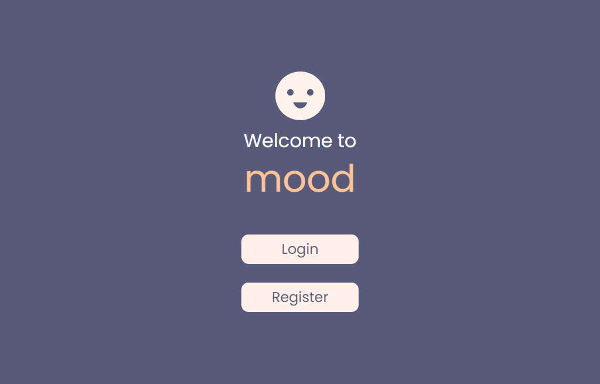
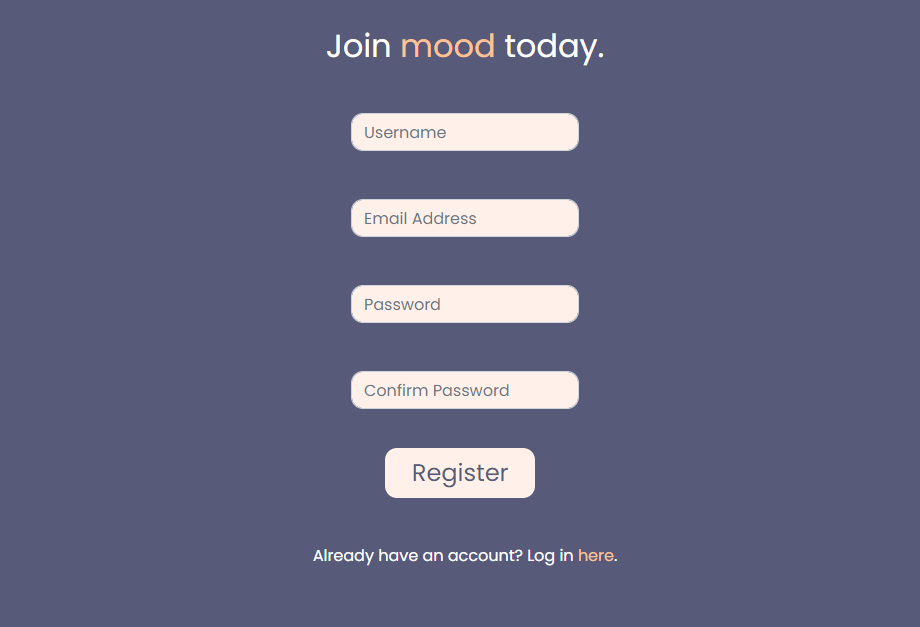
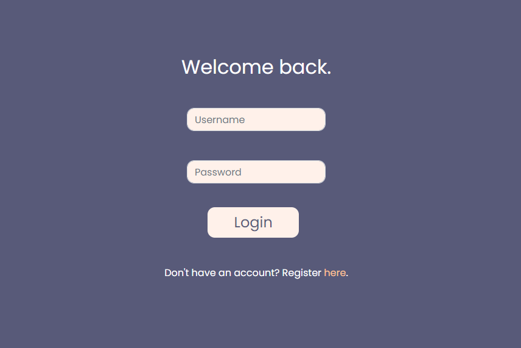
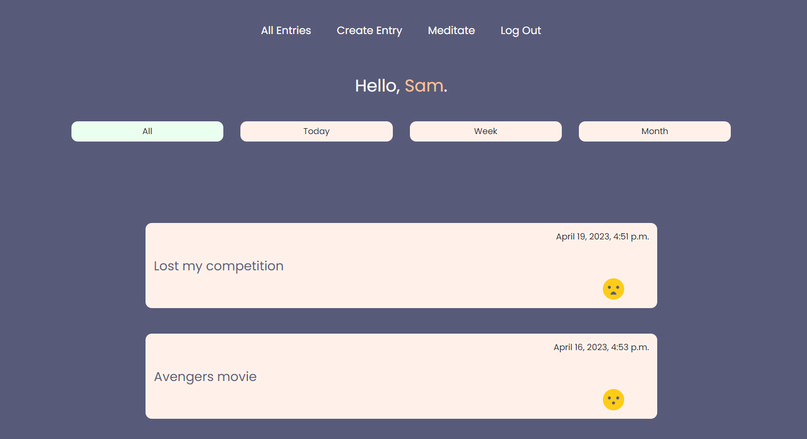
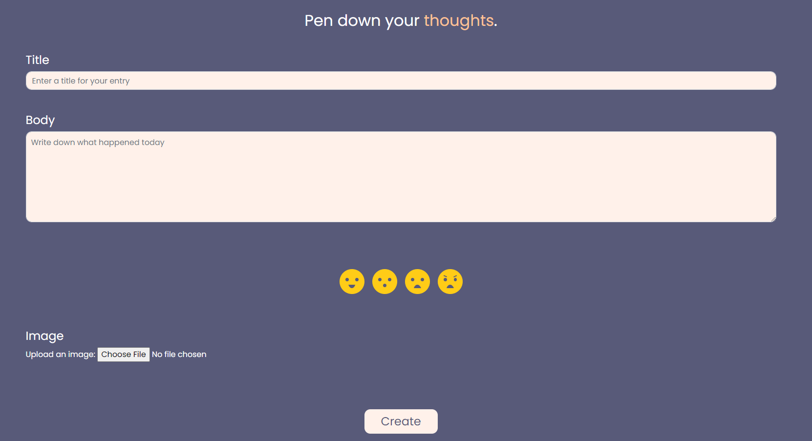
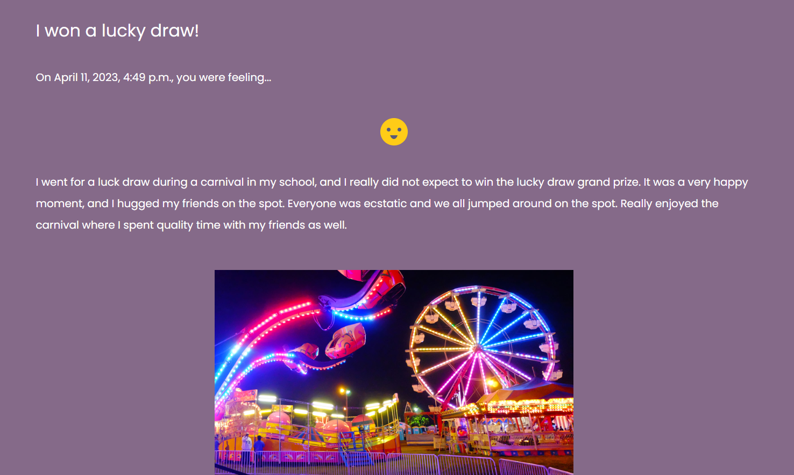
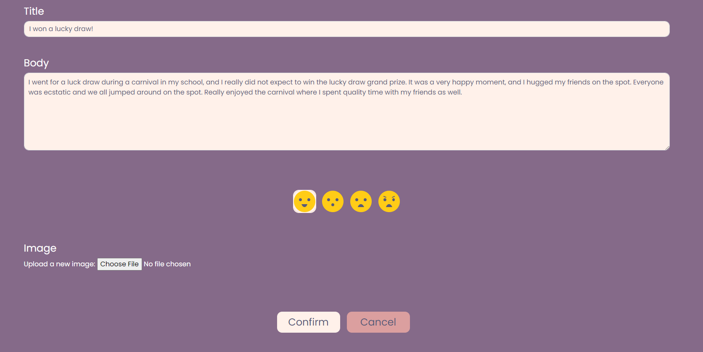
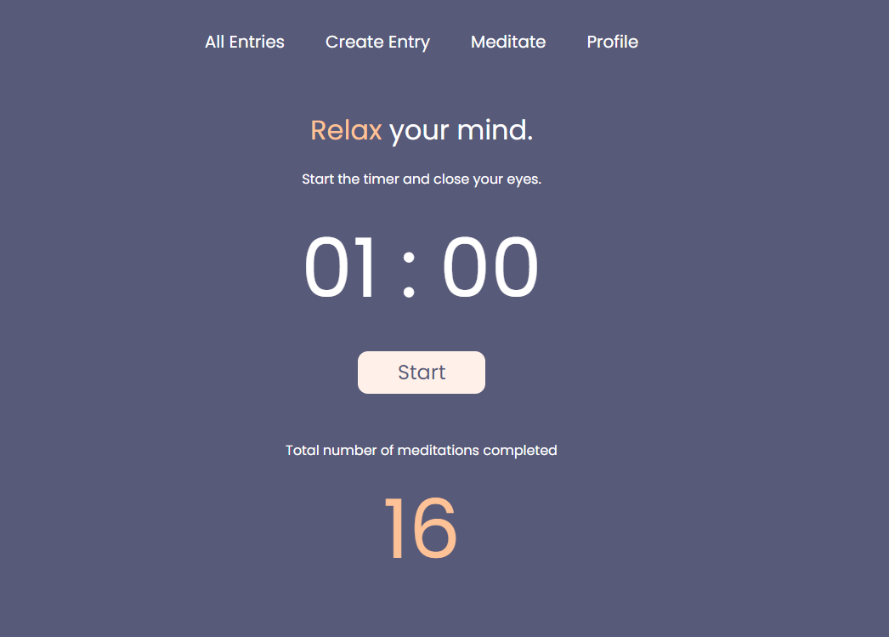
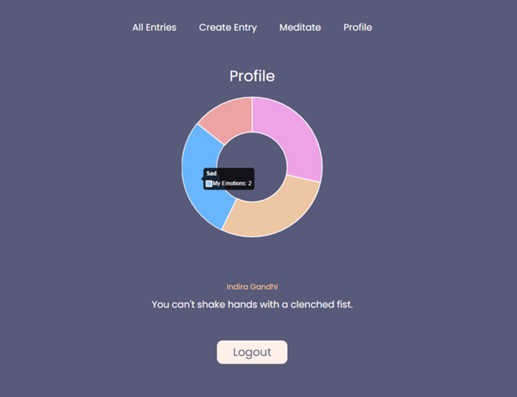

# _mood_

## About _mood_
_mood_ is a personal journal web application built using Javascript and Python. Javascript
is used for front-end interactivity while the Python Django framework is utilised for
back-end data storage. This project is submitted as my capstone project for CS50W
Web Programming with Python and Javascript. You can view a video [here](https://youtu.be/1PuJjJNb6qI) that provides
an overview of _mood_.

## File Breakdown
Most of my code resides in the `journal` folder. The following briefly explains what is contained within each file.

1. `urls.py`

This file contains the urls for the _mood_ application, which specifies which function in `views.py` will be called when the user visits the different urls.

2. `views.py`

This file contains the views for the _mood_ application, which are functions that will run
when a specific URL is visited. For example, it contains the function `copy(request, entry_number)` which has the functionality of copying an entry to the clipboard when the
URL for the copy feature is visited.

3. `models.py`

This file contains the code for the models used in the _mood_ application. In _mood_, there
are 2 models used. The models are `User` which represents a user of _mood_ and `Entry` which
represents a journal entry stored in _mood_.

4. `templates/journal`

This folder contains the HTML pages used in _mood_. I incorporated my Javascript code into
the HTML code, hence this folder is also responsible for the front-end functionality of _mood_.

| File        | Description |
| ----------- | ----------- |
| create.html    | HTML code for the webpage displaying the form responsible for creating a journal entry      |
| home.html    | HTML and Javascript code for the webpage displaying the list of journal entries     |
| index.html    | HTML code for the webpage displaying the start screen of _mood_     |
| login.html    | HTML code for the webpage displaying the form responsible for login     |
| meditate.html    | HTML and Javascript code for the webpage responsible for the `Meditate` feature      |
| profile.html    | HTML and Javascript code for the webpage displaying the user's profile      |
| register.html    | HTML code for the webpage displaying the form responsible for registration     |
| view.html    | HTML and Javascript code for the webpage displaying a specific journal entry      |

5. `static/journal`

This folder contains two main types of resources. The first are the media assets used in
_mood_, such as the emoticon images and the audio track file used for the Meditation feature. The second are the CSS files used to style the webpages in _mood_.

| File        | Description |
| ----------- | ----------- |
| angry.png     | Emoticon image for "Angry" emotion       |
| happy.png  | Emoticon image for "Happy" emotion      |
| mood_logo.png     | Logo image for _mood_       |
| sad.png  | Emoticon image for "Sad" emotion      |
| surprised.png  | Emoticon image for "Surprised" emotion      |
| create.css     | CSS code for the `create.html`       |
| home.css     | CSS code for the `home.html`       |
| index.css     | CSS code for the `index.html`       |
| login.css     | CSS code for the `login.html`       |
| meditate.css     | CSS code for the `meditate.html`       |
| profile.css     | CSS code for the `profile.html`       |
| register.css     | CSS code for the `register.html`       |
| view.css     | CSS code for the `view.html`       |
| meditation_soundtrack.mp3     | Audio soundtrack for the `Meditation` feature       |

## Requirements
There are several requirements that you need to have before you can launch _mood_. Ensure that you have pip installed before proceeding to install the other Python frameworks and modules.

### Pip Installation
Pip is a python package mangement system that allows you to install Python packages on your computer.
Ensure that you have pip installed. Otherwise, you can visit [here](https://pip.pypa.io/en/stable/installation/) to download pip.

### Django Installation
Django is a Python framework that allows you to manage databases via Python code. You can download Django
by running the command `pip install Django` in your terminal.

### Pillow Installation
Pillow is a Python library for media processing. You can download Pillow by running the command
`pip install Pillow` in your terminal.

### Pyperclip Installation
Pyperclip is a Python module that supports copy and paste clipboard functions. You can download Pyperclip by running the command `pip install pyperclip` in your terminal.

### Dateutil Installation
Dateutil is a Python module that supports operations on date and time. You can download Dateutil by running the command `pip install python-dateutil` in your terminal.

### Chart.js Installation
Chart.js is a Javascript library to visualise data through beautiful charts. You can download
Chart.js by running the command `npm install chart.js` in your terminal. Note that to use the `npm` command, you need to have [NodeJS](https://nodejs.org/en) installed.

## Quick Start
Ensure that you have installed all the necessary requirements before proceeding with the following steps.

1. Download the application by pressing the button `Code`, and then `Download Zip` on the GitHub interface.
2. A zipped folder called `mood-main.zip` will be downloaded. Unzip the folder to obtain a folder called `mood-main`. Within `mood-main`, you will see the following: `README.md` (file), `requirements.txt` (file), `mood` (folder) and `images` (folder). Take note of the path of the `mood` folder.
3. Open a terminal and change directory (via the `cd` command) to the `mood` folder mentioned in Step 2.
4. Run `python manage.py makemigrations`, followed by `python manage.py migrate`.
5. Finally, run `python manage.py runserver`. You will be prompted with a message that indicates `Starting development server at {URL}` where URL looks like an IP address.
6. Visit the URL mentioned in Step 5 through your browser.
7. Start using _mood_!

## Core Features

### Register
#### About
You need to register an account with _mood_ before you can start using it. To do so, you can use the `Register` feature which provides a nice interface for you to create an account.

#### Implementation
The registration page is shown when the user visits the url `/register`. The function `register(request)` in `views.py` handles the back-end. It differentiates between a POST and a GET
request. If the user visits `/register` via a GET request, the registration fields will
be shown to the user. Else if the user visits `/register` via a POST request, then _mood_
will process the details entered by the user. A new account will be created if the details
are valid, otherwise an error message is shown to the user.

### Login

#### About
You can log into _mood_ if you have an existing account. The `Login` feature allows you
to easily do so.

#### Implementation

The login page is shown when the user visits the url `/login`. The function `login_view(request)` in `views.py` handles the back-end. It differentiates between a POST and a GET
request. If the user visits `/login` via a GET request, the login fields will
be shown to the user. Else if the user visits `/login` via a POST request, then _mood_
will process the details entered by the user. The user will be logged in if the details
are valid, otherwise an error message is shown to the user.

### View All Entries

#### About
You can view all your journal entries once you have logged in. Apart from viewing all
your entries, you can filter the entries by date - view all entries posted today, view
all entries posted within the week, and view all entries posted within the month. Also,
pagination is implemented where you would see a maximum of 5 entries at any point in time.

#### Implementation
The url for this feature is `home/<str:criteria>` where `criteria` can be either `all`, `today`, `week` or `month`. The value of `criteria` depends on what which filter the user chooses, as indicated by the green button shown in the above diagram. A user should only be able to view his posts, hence to display the list of posts, I filtered the posts by only accepting posts whose associated owner is the current user that is logged in.

To obtain entries filtered by date, I further processed the filtered entries by checking their date fields to ensure that it satisifies the respective date filters.

### Create an Entry
#### About
You can easily add a new journal entry into _mood_ via the `Create` feature. For each entry, you can
input the following information:
1. Title of Entry
2. Content of Entry
3. Emotion (select from Happy, Surprised, Sad or Angry)
4. Image (you can upload an image from your local drive)

#### Implementation
The url for this feature is `create`. If you visit it via a GET request, the form to create a new entry
will be presented. Once you click the `Create` button, assuming that you have filled up the fields, a
POST request is made to the url and using Django, a new `Entry` will be created with the information
that you have provided. After creating the new `Entry`, a HTTPResponseRedirect will be made, redirecting
you to view the post that you have created.

### View an Entry
#### About
You can view the contents of a specific entry by clicking on it in the `View All` page. You will be able
to view the information that you have input, as well as the date at which the entry is created. An interesting
thing to note that is that the background of the site changes depending on the emotion associated with the
post that you are currently viewing!

#### Implementation
The url for this feature is `view/<int:entry_number>`. It is handled by the `view(request, entry_number)`
method in `views.py`. The method checks that you are the owner of the entry that has the id `entry_number`
before displaying the post since you are not allowed to view the posts of another user. Then, it uses
the id `entry_number` to retrieve the corresponding `Entry`. The `Entry` is then passed into the
HTML file `view.html` to render the correct information.

### Edit an Entry

#### About
You are able to edit an entry via the `Edit` button found in the page whenever you view an entry. This
allows you to easily make changes when required. Note that the fields (except the image upload) will be
prefilled with the existing information of the entry.

#### Implementation
When one presses the `Edit` button, I utilised Javascript to hide the contents of the post, and
display the edit form instead. If the user presses `Cancel`, I then did the reverse where I hid
the edit form and redisplay the contents of the post. Once the user presses `Confirm`, I would
submit the form via a POST request to the `update<int: entry_number>` url which will then update
the contents of the post. I wanted to update the content asynchronously by sending an API request,
but I was not able to figure out how to do so because of the image upload. Unlike normal text
fields, the image upload cannot be easily sent over in the form of a JSON string. Thus, in the end,
I resorted to URL redirecting instead.

### Copy an Entry
#### About
You can easily copy the text content of an journal entry to your clipboard by pressing the
`Copy` button found in the page whenever you view an entry. This allows you to easily export and
share the title and content of your entry.

#### Implementation

When one presses the `Copy` button, I will use Javascript to make an API call to the route
`copy<int: entry_number>`. This invokes the `copy(request, entry_number)` method in `views.py`,
which retrieves the corresponding entry and copy its information to the clipboard using
the Pyperclip module. I did consider using Javascript to copy the information since I can
access the entry in the HTML file, but without HTTPs, the browser prevents me from interacting
with the clipboard.

### Delete an Entry
#### About
You can delete a journal entry by pressing the `Delete` button found in the page whenever you
view an entry. Don't worry if you accidentally pressed the button, because there is an additional
confirmation message that you have to accept before the entry gets deleted.

#### Implementation
I used Javascript to create an alert using the `confirm` method. If the user confirms deletion, I
made an API call to the route `delete<int: entry_number>` which will then find the corresponding
entry and delete it. The API call is done via a POST request, so the user will not be able to use
a GET request to bypass the delete mechanism.

### Meditation
#### About
The `Meditation` feature offers a timer with a duration of 1 minute. Whenever you are feeling stressed, you
can use it to start the timer, and close your eyes while relaxing music plays in the background. Once the time
is up, the music stops. This feature also keeps track of the total number of meditations that you have
successfully completed.

#### Implementation
The timer is created using Javascript, providing a front-end interface that the user can use to start and stop
the timer when necessary. After a user successfully completes a 1-minute meditation, I would make an API call
to the url `meditate` to update the total number of the meditations that the user has completed using Django.
A JSONResponse containing the new number of meditations is returned, and I used it to asychronously update the
count that is displayed on the webpage.

As for the audio, I utilised Javascript to play the audio when the user presses the `Start` button, and stop
the audio when either the user presses the `Stop` button or when time is up.

### Profile
#### About
In the profile page, you can view a breakdown of the posts that you have made in _mood_, categorised by emotions.
Furthermore, a random inspirational quote is present to encourage you. If you wish to log out, you can also
do so via the `Logout` button present in this page.

#### Implementation
I used Chart.js to allow me to present data in a visually-appealing pie chart. I first made an API call
to the route `emotions` to return me a JSON response which captures the number of entries for each
emotion associated with the user. The values in the JSON response is then fed into the pie chart.

To display the random inspirational quote, I made an API call to an
[external API](https://type.fit/api/quotes) that hosts data regarding quotes and their authors.
Once the data arrives, I randomly pick a quote to display on screen by updating the inner HTML of the
display elements.

For the logout feature, once the user presses the logout button, he will be sent to the url
`logout` which runs the `logout_view(request)` method in `views.py`. This method would log the user out,
then redirect the user back to the `index` route which displays the start screen of _mood_.

### Responsive User Interface
_mood_ provides a responsive user interface, where the content would adapt to the size of the browser window. This is implemented primarily via CSS-Flex and media queries.

## Acknowledgements
_mood_ is only made possible with the help of the following people and resources:
1. Teaching resources from [CS50W Web Programming with Python and Javascript](https://cs50.harvard.edu/web/2020/).
2. Padsound Meditation Audio by [Samuel Francis Johnson](https://pixabay.com/users/samuelfrancisjohnson-1207793/?utm_source=link-attribution&amp;utm_medium=referral&amp;utm_campaign=music&amp;utm_content=21384) from [Pixabay](https://pixabay.com/sound-effects//?utm_source=link-attribution&amp;utm_medium=referral&amp;utm_campaign=music&amp;utm_content=21384).
3. Inspirational Quotes API by [SergeyWebPro](https://type.fit/api/quotes)
